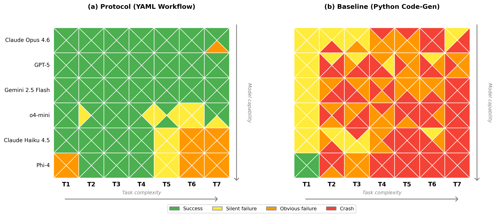

# ESFlow

**A protocol-first framework for AI-assisted Earth System Model analysis.**

> Companion repository for: *Zhou et al., "ESFlow: A Protocol-First Agentic AI Framework for Earth System Model Analysis"* (submitted to Geoscientific Model Development, 2026).

ESFlow constrains LLMs to compose validated analysis tools rather than generate arbitrary code. Scientists register tools with typed metadata; any LLM reads the auto-generated tool catalog and produces a declarative YAML workflow. A deterministic engine executes the workflow, making results reproducible and traceable.

## Key Results



We benchmarked six LLMs across seven tasks of increasing complexity, comparing the protocol-first approach (a) against unconstrained Python code generation (b). Each cell shows four independent runs, color-coded by outcome.

- **Protocol-first**: 77% overall success rate, 99% for frontier models (Claude Opus 4.6, GPT-5, Gemini 2.5 Flash), zero crashes
- **Code-generation baseline**: 2% success, 47% crashes, 23% silent failures (plausible but numerically incorrect output)
- Silent failures in the baseline are correlated across models — multiple LLMs independently make the same "reasonable" but incorrect methodological choices
- The protocol eliminates methodological silent failures by construction; residual errors are parameter-level mistakes detectable through output inspection

## How It Works

```
Scientist writes tool  →  @esflow_tool decorator  →  tool_catalog.yaml (auto)
                                                            ↓
User describes task    →  Any LLM reads catalog    →  workflow.yaml
                                                            ↓
                          run_workflow.py           →  figures, metrics, CSVs
```

1. **Tools** are Python functions decorated with `@esflow_tool(ToolSpec(...))`. The decorator registers typed inputs and outputs, validates parameters, and rejects unknown params.
2. **`generate_catalog.py`** auto-discovers all tools and writes `tool_catalog.yaml` — the sole interface between LLMs and tools.
3. **Any LLM** (ChatGPT, Claude, Gemini, Llama, etc.) reads the catalog and generates a YAML workflow from a natural-language request.
4. **`run_workflow.py`** executes the YAML step-by-step, passing outputs between tools via `${step_id.outputs.key}` references.

## Design Principles

**LLMs connect building blocks. Tools handle internals. Minimize decisions the LLM must make.**

- **24 tools** across 6 categories (fetchers, loaders, matchers, extractors, analyzers, plotters)
- **Strict validation**: unknown parameters are rejected immediately
- **No modal behavior**: each tool does exactly one thing, no mode/format switches
- **Standardized CSV schemas**: all lowercase column names
- **Simple observation format**: one CSV per gauge (`date`, `discharge_m3s`)

## Quick Start

```bash
# Clone and install
git clone https://github.com/pnnl-int/esflow.git
cd esflow
pip install -r requirements.txt

# Download sample data from Zenodo (E3SM output + GRDC observations)
# https://doi.org/10.5281/zenodo.19350842
# Extract into data/sample/ so you have data/sample/e3sm/ and data/sample/obs/

# Validate a workflow (no data needed)
python run_workflow.py reference_workflows/task01_reference.yaml --dry-run

# Run a reference workflow
python run_workflow.py reference_workflows/task01_reference.yaml

# Reuse existing intermediate files
python run_workflow.py workflows/examples/obs_only_validation.yaml --reuse
```

## Generating Workflows with an LLM

1. Combine `docs/system_prompt.txt` + `tools/tool_catalog.yaml` as the system message
2. Describe your analysis task in natural language as the user message
3. Save the generated YAML and validate with `--dry-run`
4. Run it

See **[docs/guide.md](docs/guide.md)** for the full protocol, task description examples, and instructions for adding your own tools.

## Tools (24)

| Category | Tool | Description |
|----------|------|-------------|
| fetchers | `fetch_ilamb_data` | Download observation datasets from ILAMB server |
| loaders | `load_obs_metadata` | Load and validate gauge metadata CSV |
| matchers | `match_to_grid` | Match observation gauges to E3SM model grid cells |
| extractors | `extract_e3sm_timeseries` | Extract model time series at matched locations |
| extractors | `extract_obs_timeseries` | Extract observation time series from per-gauge CSVs |
| extractors | `extract_gridded_field` | Extract time-mean gridded field from ESM output |
| extractors | `extract_basin_mean` | Extract basin-mean time series using GeoJSON polygons |
| analyzers | `compute_metrics` | Compute NSE, KGE, PBIAS, RMSE, correlation |
| analyzers | `compute_climatology` | Compute monthly climatology (mean by month 1-12) |
| analyzers | `compute_summary_stats` | Compute mean, std, min, max statistics |
| analyzers | `compute_spatial_bias` | Compute spatial bias between two gridded fields |
| analyzers | `compute_zonal_stats` | Area-weighted statistics by latitude band |
| analyzers | `compute_fdc_metrics` | Flow duration curve metrics (Wasserstein, volume bias) |
| analyzers | `compute_basin_budget` | Compute per-basin water budget (P, ET, Q, residual) |
| plotters | `plot_timeseries` | Multi-panel sim vs obs time series comparison |
| plotters | `plot_scatter` | Scatter plot of mean discharge (sim vs obs) |
| plotters | `plot_map` | Validation metric values on a geographic map |
| plotters | `plot_gridded_map` | Global map of a gridded field with optional stats |
| plotters | `plot_fdc` | Flow duration curve comparison plot |
| plotters | `plot_bias_comparison` | Side-by-side model, obs, and bias maps |
| plotters | `plot_basin_timeseries` | Per-basin sim vs obs time series with metrics |
| plotters | `plot_basin_budget_comparison` | Model vs obs water budget bar charts |
| plotters | `plot_basin_radar` | Radar charts of multi-metric basin diagnostics |
| plotters | `plot_water_balance_basins` | Composite water balance figure (global + basins) |

## Standard Data Schemas

Tools communicate through typed CSV files. The catalog declares exact column schemas so an LLM can wire tools together without guessing.

| Schema | Index | Columns | Producers | Consumers |
|--------|-------|---------|-----------|-----------|
| **gauge_metadata** | row | `gauge_id`, `lat`, `lon`, `area_km2`, `river_name` | loaders | matchers, extractors, plotters |
| **matched_gauges** | row | `gauge_id`, `lat`, `lon`, `model_lat`, `model_lon`, `lat_idx`, `lon_idx` | matchers | extractors |
| **timeseries** | `time` | one column per `gauge_id` | extractors | analyzers, plotters |
| **climatology** | `month` (1-12) | one column per `gauge_id` | compute_climatology | plotters |
| **metrics** | row | `gauge_id`, `nse`, `kge`, `pbias`, `rmse`, `correlation`, `n_valid` | compute_metrics | plotters |

## Sample Data

ESFlow includes 94 representative GRDC gauges for testing:

```
data/sample/obs/
├── gauge_metadata.csv              # 94 gauges: gauge_id, lat, lon, area_km2, river_name
└── streamflow/
    ├── 1147013.csv                 # date, discharge_m3s (Congo at Kinshasa)
    ├── 2181900.csv                 # date, discharge_m3s (Yangtze at Datong)
    └── ...                         # 94 files total
```

## Example Workflows

| Workflow | Steps | What it does |
|----------|-------|-------------|
| `obs_only_validation.yaml` | 7 | Self-test: obs vs obs (all metrics should be perfect) |
| `single_gauge_comparison.yaml` | 6 | Compare E3SM MOSART discharge vs observations |
| `multi_gauge_validation.yaml` | 9 | Full validation with metrics, climatology, scatter, and map |

## Benchmarking LLMs

ESFlow includes a benchmark runner that evaluates how well different LLMs compose workflows from the tool catalog.

### Scoring Levels

| Level | What it tests | Automated? |
|-------|--------------|------------|
| S0 | Valid YAML with `steps` key | Yes |
| S1 | Passes `--dry-run` (correct tool names, required params, valid wiring) | Yes |
| S2 | Executes without runtime error (requires data) | Yes |
| S3 | Scientifically correct output (right variables, methods, interpretation) | Human review |

```bash
# Quick test
export LLM_API_KEY="your-key-here"
python benchmark/run_benchmark.py --task benchmark/protocol/task_01_obs_summary.txt

# Full benchmark (all models, 3 runs each)
python benchmark/run_benchmark.py --all --runs 3

# Local models via LM Studio
python benchmark/run_benchmark.py --local
```

## CLI Options

```
python run_workflow.py <workflow.yaml> [options]

Options:
  --dry-run, -n       Validate workflow without executing
  --verbose, -v       Print detailed progress
  --start-from, -s    Jump to a specific step (earlier steps assumed complete)
  --reuse, -r         Reuse existing intermediate files
```

## Adding a New Tool

See **[docs/guide.md](docs/guide.md)** for a complete walkthrough with examples. The short version:

1. Create `tools/<category>/my_tool.py` with a `ToolSpec` and `@esflow_tool` decorator
2. Run `python tools/generate_catalog.py --overwrite` to update the catalog
3. The LLM sees your tool in the catalog automatically

## Project Structure

```
esflow/
├── run_workflow.py              # Workflow engine
├── requirements.txt
├── docs/
│   ├── guide.md                # Full protocol guide (adding tools, prompting LLMs)
│   └── system_prompt.txt       # System prompt template for LLM workflow generation
├── tools/
│   ├── generate_catalog.py      # Auto-generates tool_catalog.yaml
│   ├── tool_catalog.yaml        # LLM-readable tool metadata (24 tools)
│   ├── core/                    # Framework internals
│   │   ├── base.py              # @esflow_tool, Param, ToolSpec, TOOL_REGISTRY
│   │   ├── e3sm.py              # ESM utilities (cftime, file discovery, dataset opening)
│   │   ├── schemas.py           # CSV schema documentation
│   │   ├── data_io.py           # MOSART/ELM data loading
│   │   ├── spatial.py           # Grid matching, river tracing
│   │   └── styling.py           # Plot style presets
│   ├── fetchers/                # Data fetching tools (1)
│   ├── loaders/                 # Data loading tools (1)
│   ├── matchers/                # Gauge matching tools (1)
│   ├── extractors/              # Data extraction tools (4)
│   ├── analyzers/               # Metrics and statistics tools (7)
│   └── plotters/                # Visualization tools (10)
├── data/sample/                 # Sample observation data (94 GRDC gauges)
├── reference_workflows/          # 7 reference YAML workflows
└── benchmark/
    ├── protocol/                # System prompt + task descriptions
    ├── baselines/               # Code-gen baseline prompts
    ├── run_benchmark.py         # Multi-model benchmark runner
    └── results/                 # Auto-generated outputs + scores (Zenodo)
```
